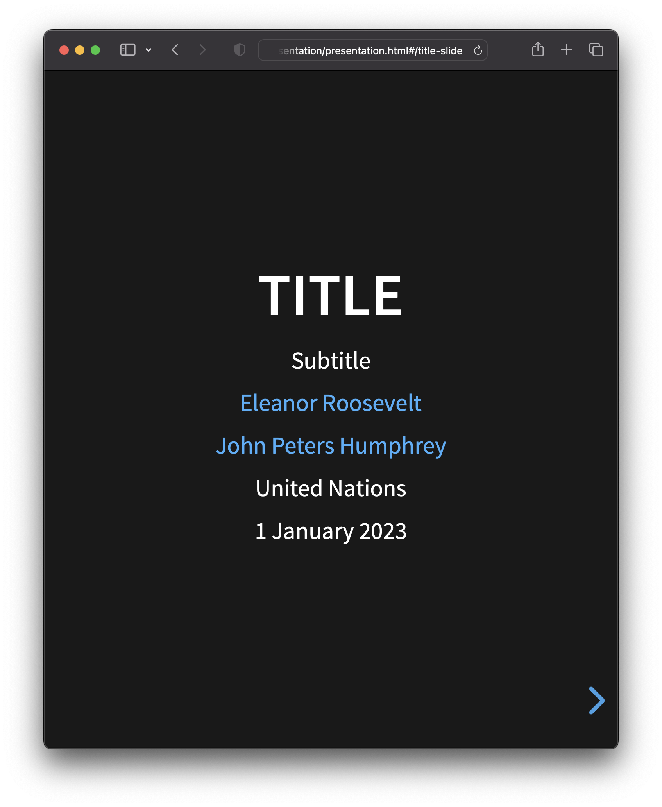
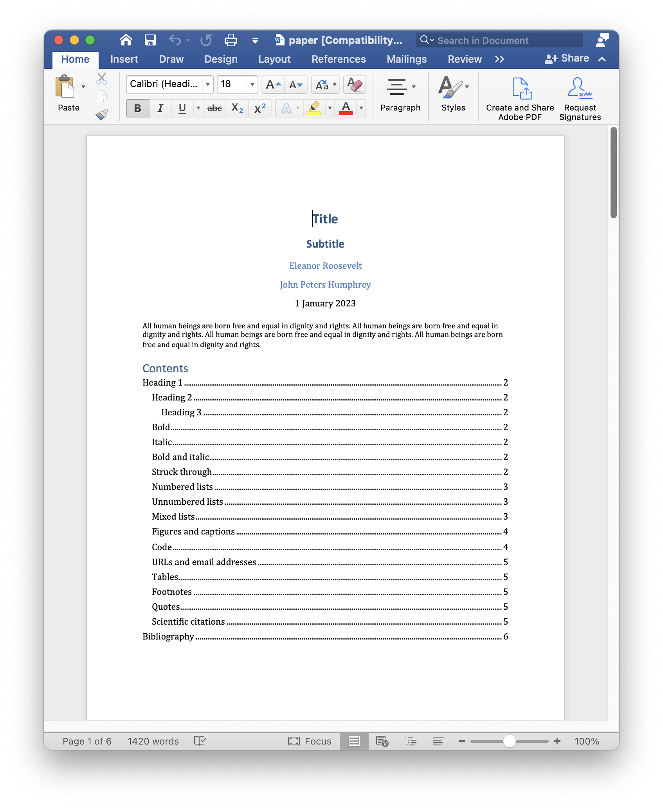
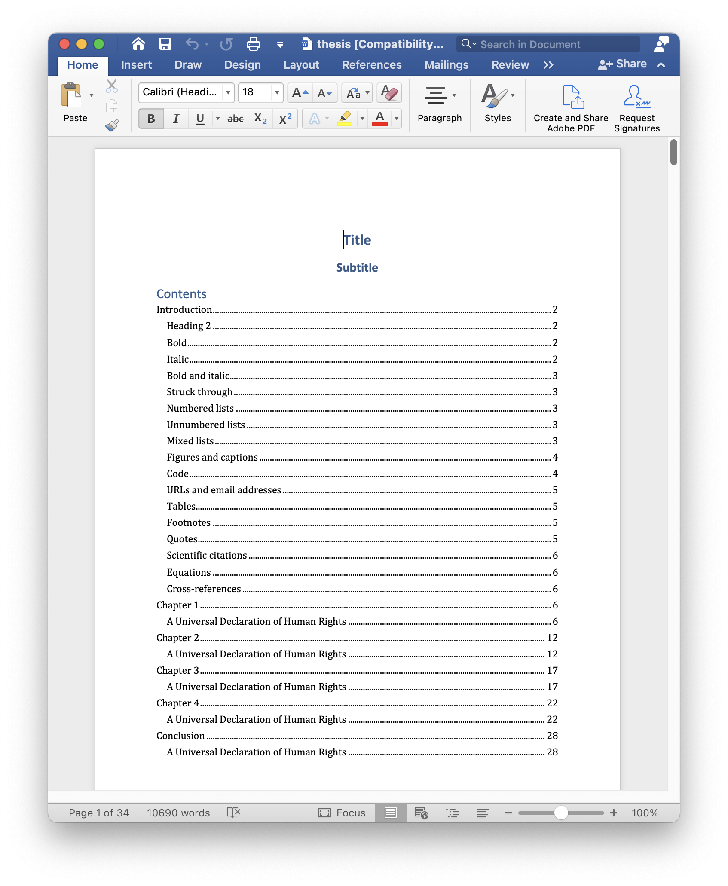
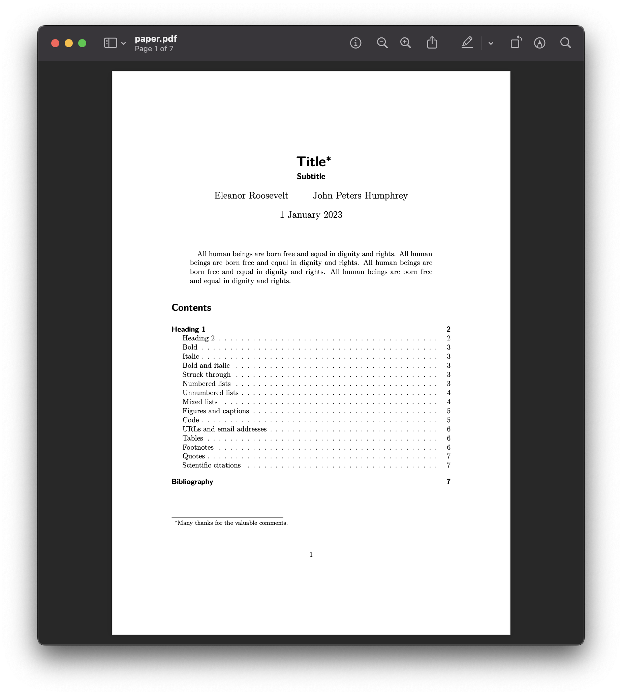
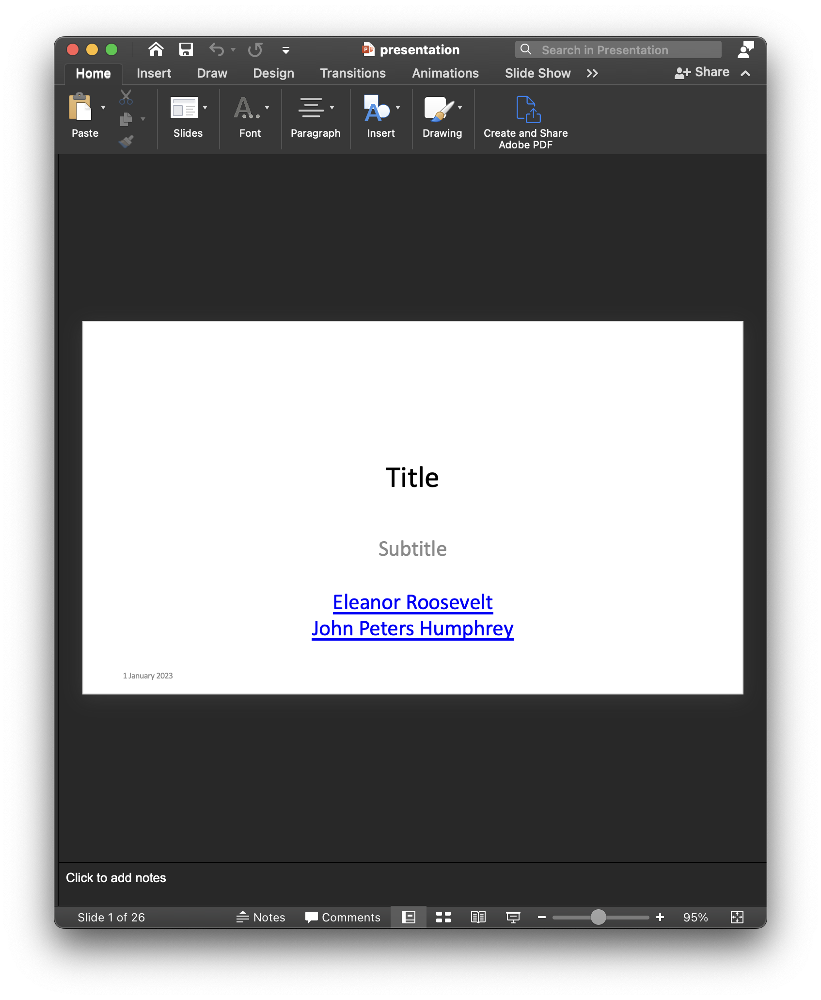
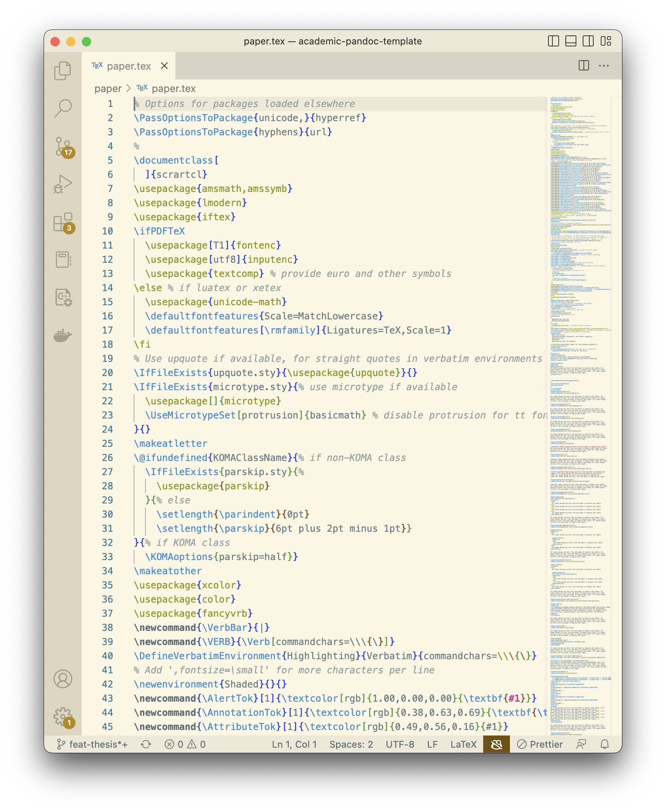
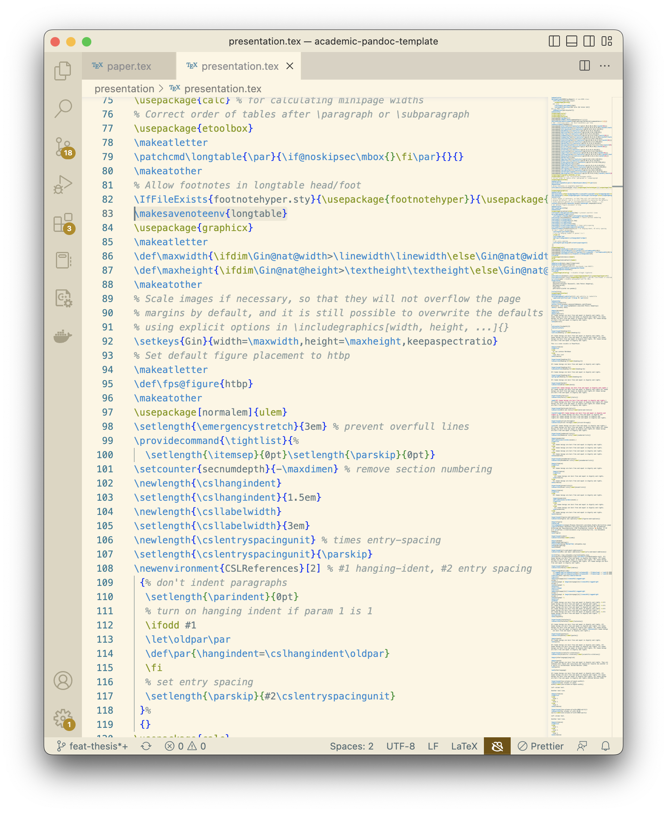
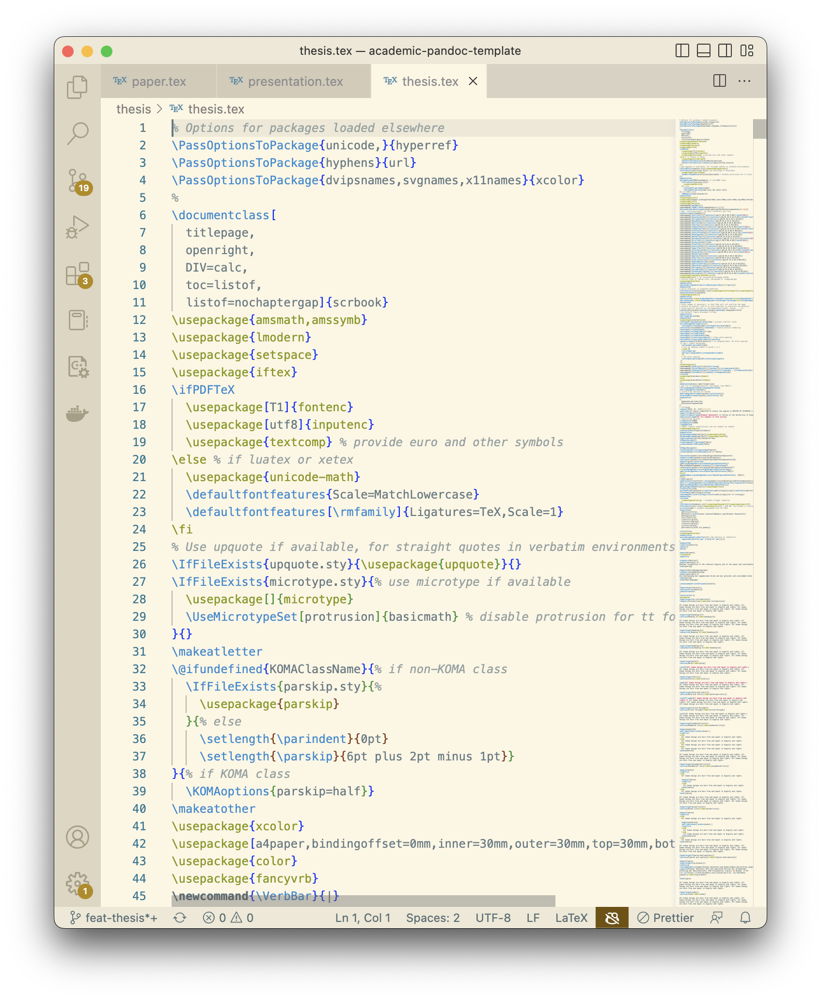
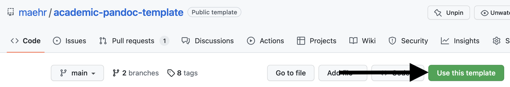
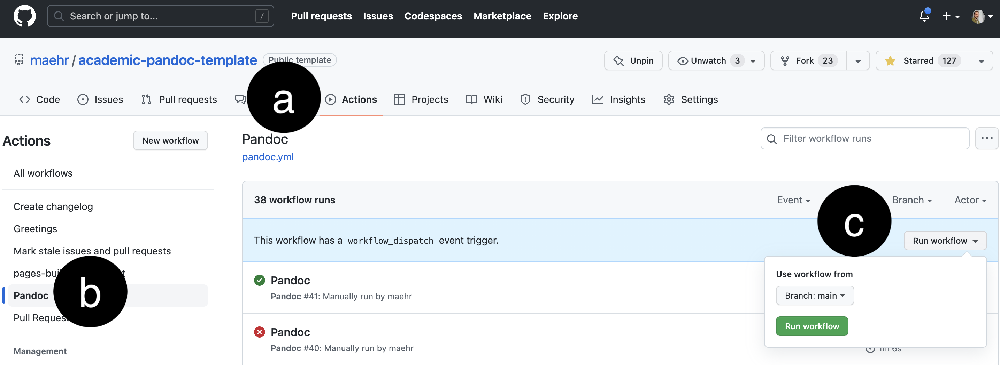

# Academic Pandoc template

[Pandoc](http://pandoc.org/MANUAL.html) [markdown](https://daringfireball.net/projects/markdown/syntax) templates for academic articles, presentations and theses to write distraction-free while maintaining beautiful typesetting.

[](https://github.com/maehr/academic-pandoc-template/issues)
[](https://github.com/maehr/academic-pandoc-template/network)
[](https://github.com/maehr/academic-pandoc-template/stargazers)
[](https://github.com/maehr/academic-pandoc-template/blob/master/LICENSE.md)
[](https://zenodo.org/badge/latestdoi/139726344)

<!-- prettier-ignore -->

| from md |                [article](article/article.md)                |                [presentation](presentation/presentation.md)                |                  [thesis](thesis/00.md)                  |
| :------ | :---------------------------------------------------------: | :------------------------------------------------------------------------: | :------------------------------------------------------: |
| <br />  |     [](article/article.md)    |     [](presentation/presentation.md)    |       [](thesis/00.md)      |
| to html |                            <br />                           | [](presentation/presentation.html) |                          <br />                          |
| to docx | [](article/article.docx) |                                   <br />                                   |  [](thesis/thesis.pdf) |
| to epub |                            <br />                           |                                   <br />                                   | [](thesis/thesis.epub) |
| to pdf  |  [](article/article.pdf)  |  [](presentation/presentation.pdf)  |  [](thesis/thesis.pdf)  |
| to pptx |                            <br />                           | [](presentation/presentation.pptx) |                          <br />                          |
| to tex  |  [](article/article.tex)  |  [](presentation/presentation.tex)  |  [](thesis/thesis.tex)  |

## Getting Started

Follow the [The Markdown Guide](https://www.markdownguide.org/) and make sure you have a Markdown editor like [Zettlr](https://www.zettlr.com/) and a Bibtex editor like [JabRef](http://www.jabref.org/) installed.

### Use it online

1. [Use this template](https://github.com/maehr/academic-pandoc-template/generate) or [fork](https://docs.github.com/en/get-started/quickstart/fork-a-repo) this repository.[](https://github.com/maehr/academic-pandoc-template/generate)
2. Edit [article/article.md](article/article.md), [presentation/presentation.md](presentation/presentation.md) or [thesis/](thesis) according to the [The Markdown Guide](https://www.markdownguide.org/) [online](https://docs.github.com/en/github/managing-files-in-a-repository/managing-files-on-github/editing-files-in-your-repository), with [Zettlr](https://www.zettlr.com/) or another [Markdown editor](https://www.markdownguide.org/tools/)
3. Edit [article/references.bib](article/references.bib), [presentation/references.bib](presentation/references.bib) or [thesis/references.bib](thesis/references.bib) [online](https://docs.github.com/en/github/managing-files-in-a-repository/managing-files-on-github/editing-files-in-your-repository), with [JabRef](http://www.jabref.org/) or with your favorite Bibtex editor
4. [Commit](https://docs.github.com/en/desktop/contributing-and-collaborating-using-github-desktop/making-changes-in-a-branch/committing-and-reviewing-changes-to-your-project) your changes
5. Manually run the [Pandoc GitHub actions](https://github.com/maehr/academic-pandoc-template/actions/workflows/pandoc.yml) to build your document. They will be commited to main branch as well. [](https://github.com/maehr/academic-pandoc-template/actions/workflows/pandoc.yml)
   a. Click on [Actions](https://github.com/maehr/academic-pandoc-template/actions) in the top menu
   b. Click on [Pandoc](https://github.com/maehr/academic-pandoc-template/actions/workflows/pandoc.yml) in the left menu
   c. Click on `Run workflow` in the top right corner

### Use it locally

Install all prerequisites

#### For Linux/Mac

- [Make](https://www.gnu.org/software/make/)
- [Pandoc](http://pandoc.org/installing.html)
- [Tectonic](https://tectonic-typesetting.github.io/) or another [LaTeX](https://www.latex-project.org/get/) distribution

Open your command line and execute one of the following commands.

- `make all` to build all documents
- `make article` to build the article
- `make article-docx article-pdf article-tex` to build the article in different formats
- `make presentation` to build the presentation
- `make presentation-html presentation-pdf presentation-pptx presentation-tex` to build the presentation in different formats
- `make thesis` to build the thesis
- `make thesis-docx thesis-epub thesis-pdf thesis-tex` to build the thesis in different formats
- `make help` to get a list of all available commands

#### For Windows

**Prerequisites**:

- [7-Zip](https://www.7-zip.org/) - Required for extracting downloaded tools

1. **First time setup**: Run `setup.bat` to download and install required tools (Pandoc, Pandoc-crossref, Tectonic)
2. **Build documents**: Open Command Prompt or PowerShell and use the build script:
   - `build.bat article` to build the article
   - `build.bat article-docx` to build article in DOCX format
   - `build.bat article-pdf` to build article in PDF format
   - `build.bat article-tex` to build article in TeX format
   - `build.bat presentation` to build the presentation
   - `build.bat thesis` to build the thesis
   - `build.bat all` to build all documents
   - `build.bat clean` to clean build artifacts
   Or use PowerShell:

| Target         | Description                                                |
| -------------- | ---------------------------------------------------------- |
| `article`      | Build article (docx, pdf, tex) [alias: `a`]                 |
| `article-docx` | Build article in DOCX format [alias: `ad`]                  |
| `article-pdf`  | Build article in PDF format [alias: `ap`]                   |
| `article-tex`  | Build article in TeX format [alias: `at`]                   |
| `presentation` | Build presentation [alias: `p`, `pt`]                      |
| `thesis`       | Build thesis [alias: `t`]                                  |
| `all`          | Build all documents                                         |
| `clean`        | Clean build artifacts                                       |
| `help`         | Show help message                                           |
| `setup`        | Install required tools (Pandoc, Pandoc-crossref, Tectonic) |

**Quick Shortcuts** (build.ps1 only):

| Shortcut | Equivalent Command | Description |
| -------- | ----------------- | ----------- |
| `ad` | `article-docx` | Build article DOCX |
| `ap` | `article-pdf` | Build article PDF |
| `at` | `article-tex` | Build article TeX |
| `ph` | `p --html` | Build presentation HTML |
| `pd` | `p --pdf` | Build presentation PDF |
| `pp` | `p --pptx` | Build presentation PPTX |
| `px` | `p --tex` | Build presentation TeX |

**Note**: You can pass multiple targets at once, e.g., `.\build.ps1 article-docx article-pdf`.

**Article/a Build Features** (build.ps1 only):

| Feature                    | Description                                                       |
| ------------------------- | ----------------------------------------------------------------- |
| **Single Format Output**   | Build only one format: `.\build.ps1 a --pdf`                      |
| **Multiple Format Flags**  | Build specific formats: `.\build.ps1 a --docx --tex`              |
| **Format Options**        | `--docx`, `--pdf`, `--tex`                                        |

**Presentation/pt Build Features** (build.ps1 only):

| Feature                    | Description                                                       |
| ------------------------- | ----------------------------------------------------------------- |
| **Custom Input File**     | Build with any markdown file: `.\build.ps1 pt myslides.md`        |
| **Smart Output Naming**   | Output files named after input file (e.g., `myslides.html`, `myslides.pdf`) |
| **Single Format Output**   | Build only one format: `.\build.ps1 pt --pdf`                     |
| **Multiple Format Flags**  | Build specific formats: `.\build.ps1 pt --html --tex`             |
| **Format Options**        | `--html`, `--pdf`, `--pptx`, `--tex`                             |

**Examples**:
```powershell
# Build article (all formats)
.\build.ps1 article
.\build.ps1 a

# Build article with specific formats
.\build.ps1 a --pdf
.\build.ps1 a --docx --tex
.\build.ps1 ad

# Build presentation with default content.md
.\build.ps1 presentation
.\build.ps1 p

# Build presentation with custom file and auto-generated output names
.\build.ps1 presentation myslides.md
# Creates: myslides.html, myslides.pdf, myslides.pptx, myslides.tex

# Build presentation with specific formats
.\build.ps1 pt --pdf
.\build.ps1 p mylecture.md --html --tex

# Use quick shortcuts for even faster builds
.\build.ps1 ad          # Build article DOCX
.\build.ps1 ap          # Build article PDF
.\build.ps1 at          # Build article TeX
.\build.ps1 ph          # Build presentation HTML
.\build.ps1 pp          # Build presentation PPTX
.\build.ps1 pd          # Build presentation PDF
.\build.ps1 px          # Build presentation TeX
```

**build.ps1 vs build.bat**:

| Feature                      | `build.bat`  | `build.ps1`                |
| ---------------------------- | ------------ | -------------------------- |
| **Language**                 | Batch script | PowerShell script          |
| **Tool Installation**        | ❌ No         | ✅ Yes (`setup` target)     |
| **Error Handling**           | Basic        | Advanced (retry mechanism) |
| **Color Output**             | ❌ No         | ✅ Yes                      |
| **Multi-target Build**       | ❌ No         | ✅ Yes                      |
| **Background Image Support** | ❌ No         | ✅ Yes (for presentations)  |

**Recommendation**: Use `build.ps1` for full functionality including tool installation, better error handling, and multi-target builds. Use `build.bat` only if you have all tools pre-installed and need minimal overhead.

**Note**: You can also use the Git Bash or WSL (Windows Subsystem for Linux) to use the Make commands directly on Windows.

## Linting and formatting

Install the latest version of [Node](https://nodejs.org/) and all dependencies.

```bash
npm install
```

To use linting and formatting, use the following commands.

```bash
npm run check
npm run format
```

## Configuration

Change the [variables](https://pandoc.org/MANUAL.html#variables) in the frontmatter in [article/article.md](article/article.md) or [thesis/00.md](thesis/00.md) to configure your document.

For presentations, the metadata and content are separated into two files for better organization:

- [presentation/metadata.yaml](presentation/metadata.yaml) - Document metadata (title, author, date, theme settings, etc.)
- [presentation/content.md](presentation/content.md) - Main content of the presentation

You can build presentations with any custom markdown file using the build script. See the **Presentation/pt Build Features** section above for details.

```yaml
author:
  - '[Eleanor Roosevelt](eleanor.eoosevelt@domain.com)'
  - '[John Peters Humphrey](jph@domain.com)'
bibliography: references.bib # bibliography to use for resolving references
csl: ../assets/csl/chicago-note-bibliography.csl
date: 1 January 2023
keywords: # list of keywords to be included in HTML, PDF, ODT, pptx, docx and AsciiDoc metadata; repeat as for author, above
lang: en-US
```

Change the [default files](https://pandoc.org/MANUAL.html#defaults-files) to your needs:

- [default.yaml](default.yaml) for the default configuration
- [article/docx.yaml](article/docx.yaml) for the article docx configuration
- [article/pdf.yaml](article/pdf.yaml) for the article pdf configuration
- [article/tex.yaml](article/tex.yaml) for the article tex configuration
- [presentation/html.yaml](presentation/html.yaml) for the presentation html configuration
- [presentation/ppxt.yaml](presentation/ppxt.yaml) for the presentation pptx configuration
- [presentation/pdf.yaml](presentation/pdf.yaml) for the presentation pdf configuration
- [presentation/tex.yaml](presentation/tex.yaml) for the presentation tex configuration
- [thesis/docx.yaml](thesis/docx.yaml) for the thesis docx configuration
- [thesis/epub.yaml](thesis/epub.yaml) for the thesis epub configuration
- [thesis/pdf.yaml](thesis/pdf.yaml) for the thesis pdf configuration
- [thesis/tex.yaml](thesis/tex.yaml) for the thesis tex configuration

## Crossref References

This template uses [pandoc-crossref](https://lierdakil.github.io/pandoc-crossref/) to handle cross-references for equations, figures, and tables. Configuration is done in the YAML frontmatter.

### Equation References

In your markdown file, use `{#eq:label}` after the closing `$$` of equation blocks:

```markdown
$$
\begin{align}
E &= mc^2 \\
F &= ma
\end{align}
$${#eq:emc2}

引用公式[@eq:emc2].
```

Build with the docx format to generate numbered equations with right-aligned references:

```powershell
.\build.ps1 article-docx
# or
.\build.ps1 ad
```

### Figure and Table References

```markdown
{#fig:id}

Table: Caption {#tbl:id}

| Column 1 | Column 2 |
|----------|----------|
| Data     | Data     |

图[@fig:id]展示了示例。图[@fig:id]展示了示例。

Table [@tbl:id] shows the data.
```

### Configuration Options

These options can be set in the YAML frontmatter:

| Option | Description | Default |
|--------|-------------|---------|
| `tableEqns` | Use table layout for equations | `false` |
| `linkReferences` | Generate hyperlinks for references | `false` |
| `nameInLink` | Include reference name in link | `false` |
| `eqnPrefixTemplate` | Template for equation number prefix | `($$i$$)` |
| `figureTitle` | Title for figures | `"Figure"` |
| `tableTitle` | Title for tables | `"Table"` |

### Chinese Configuration Example

```yaml
lang: zh-CN
tableEqns: true
linkReferences: true
nameInLink: true
eqnPrefixTemplate: ($$i$$)
figureTitle: "图"
tableTitle: "表"
figPrefix:
  - "图"
  - "图集"
eqnPrefix:
  - "公式"
```

## LaTeX Macros

This template supports LaTeX macros that can be used in both markdown math blocks and are automatically expanded in PDF output.

### Available Macros

The following macros are pre-defined:

| Macro | LaTeX | Example |
|-------|-------|---------|
| `\x` | `\mathbf{x}` | `$\x$` → **x** |
| `\X` | `\mathbf{X}` | `$\X$` → **X** |
| `\loss` | `\mathcal{L}` | `$\loss$` → ℒ |
| `\mat{A}` | `\mathbf{#1}` | `$\mat{A}$` → **A** |
| `\add{a}{b}` | `#1 + #2` | `$\add{a}{b}$` → a + b |
| `\mult{x}{y}` | `#1 \times #2` | `$\mult{x}{y}$` → x × y |
| `\func{x}{y}{z}` | `f(#1,#2,#3)` | `$\func{1}{2}{3}$` → f(1,2,3) |

### Usage in Markdown

Use macros directly in math blocks:

```markdown
$$
\loss = \sum_{i=1}^{n} \func{\x_i}{\X_i}{\theta}
$$
```

### Adding Custom Macros

To add new macros, edit `article/macros.tex` and add new `\newcommand` definitions:

```latex
% In article/macros.tex
\newcommand{\add}[2]{#1 + #2}
\newcommand{\myvec}[1]{\mathbf{#1}}
```

The `build.ps1` script automatically regenerates `expand-macros.lua` from `macros.tex` before each build. Then rebuild:

```powershell
.\build.ps1 article-pdf
# or
.\build.ps1 ap
```

## Conventional Commits

Use [Conventional Commits](https://www.conventionalcommits.org/en/v1.0.0/) for adding human and machine readable meaning to commit messages. To use [commitizen](https://github.com/commitizen/cz-cli), use the following commands.

```bash
npm run commit
```

## Support

This project is maintained by [@maehr](https://github.com/maehr). Please understand that we won't be able to provide individual support via email. We also believe that help is much more valuable if it's shared publicly, so that more people can benefit from it.

| Type                                   | Platforms                                                                        |
| -------------------------------------- | -------------------------------------------------------------------------------- |
| 🚨 **Bug Reports**                     | [GitHub Issue Tracker](https://github.com/maehr/academic-pandoc-template/issues) |
| 🎁 **Feature Requests**                | [GitHub Issue Tracker](https://github.com/maehr/academic-pandoc-template/issues) |
| 🛡 **Report a security vulnerability** | [GitHub Issue Tracker](https://github.com/maehr/academic-pandoc-template/issues) |

## Built With

- [commitizen](https://github.com/commitizen/cz-cli)
- [git-cliff](https://github.com/orhun/git-cliff)
- [husky](https://github.com/typicode/husky)
- [Pandoc](https://pandoc.org/) a universal document converter and
- [Pandoc GitHub action](https://github.com/pandoc/pandoc-action-example)
- [Prettier](https://prettier.io/) an opinionated code formatter
- [Tectonic](https://tectonic-typesetting.github.io/en-US/) a modernized, complete, self-contained [TeX](https://www.tug.org/)/[LaTeX](https://www.latex-project.org/) engine, powered by [XeTeX](http://xetex.sourceforge.net/) and [TeXLive](https://www.tug.org/texlive/)
- [Tectonic GitHub action](https://github.com/WtfJoke/setup-tectonic)

## Roadmap

- [x] Refactoring of the article template
- [x] Templates for presentation and thesis
- [x] Change name of master branch to main
- [ ] Improve documentation
- [ ] Improve caching in `.github/workflows/pandoc.yml`

## Contributing

Please read [CONTRIBUTING.md](https://github.com/maehr/academic-pandoc-template/blob/master/CONTRIBUTING.md) for details on our code of conduct, and the process for submitting pull requests to us.

## Versioning

We use [SemVer](http://semver.org/) for versioning. For the versions available, see the [tags on this repository](https://github.com/maehr/academic-pandoc-template/tags).

## Authors

- **Moritz Mähr** - _Initial work_ - [maehr](https://github.com/maehr)

See also the list of [contributors](https://github.com/maehr/academic-pandoc-template/graphs/contributors) who participated in this project.

## License

This project is licensed under the MIT License - see the [LICENSE.md](LICENSE.md) file for details

## Acknowledgments

- Sarah Simpkin, "Getting Started with Markdown," _Programming Historian_ 4 (2015), <https://doi.org/10.46430/phen0046>.
- Dennis Tenen and Grant Wythoff, "Sustainable Authorship in Plain Text using Pandoc and Markdown," _Programming Historian_ 3 (2014), <https://doi.org/10.46430/phen0041>.

