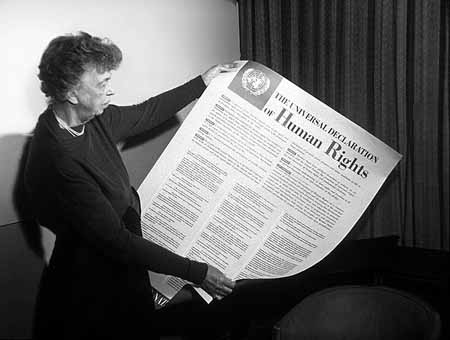

# Heading 1

1. 多行公式示例（LaTeX 语法）
$$
\begin{align}
E &= mc^2 \\
F &= ma \\
\int_{-\infty}^{\infty} e^{-x^2} dx &= \sqrt{\pi} 
\end{align}
$${#eq:gauss}
引用公式[@eq:gauss]. All human beings are born free and equal in dignity and rights. All human beings are born free and equal in dignity and rights. All human beings are born free and equal in dignity and rights. All human beings are born free and equal in dignity and rights.

2. 测试向量和矩阵符号（使用自定义宏）
$$
\x \quad \X \quad \loss
$$

3. 测试函数定义
$$
\func{x}{y}{z}
$$

4. 组合测试
$$
\loss = \sum_{i=1}^{n} \func{\x_i}{\X_i}{\theta}
$$

5. 测试单参数宏
$$
\vec{v} \quad \mat{A}
$$

6. 测试双参数宏
$$
\add{a}{b} \quad \mult{x}{y}
$${#eq:add_mult}

## Heading 2

参考文献引用示例[@brown2016].
All human beings are born free and equal in dignity and rights, crossref [@eq:add_mult]. All human beings are born free and equal in dignity and rights. All human beings are born free and equal in dignity and rights. All human beings are born free and equal in dignity and rights.

### Heading 3

All human beings are born free and equal in dignity and rights. All human beings are born free and equal in dignity and rights. All human beings are born free and equal in dignity and rights. All human beings are born free and equal in dignity and rights.

测试带编号的多行公式

$$ \begin{equation} \begin{aligned} \sin^2 x + \cos^2 x &= 1 \\ \tan x &= \frac{\sin x}{\cos x} \end{aligned}\end{equation} $${#eq:tri}	

#### Heading 4

Test equation reference [@eq:tri].  All human beings are born free and equal in dignity and rights. All human beings are born free and equal in dignity and rights. All human beings are born free and equal in dignity and rights. All human beings are born free and equal in dignity and rights.

## Bold

**All human beings are born free and equal in dignity and rights.** All human beings are born free and equal in dignity and rights.All human beings are born free and equal in dignity and rights.All human beings are born free and equal in dignity and rights.

## Italic

_All human beings are born free and equal in dignity and rights._ All human beings are born free and equal in dignity and rights.All human beings are born free and equal in dignity and rights.All human beings are born free and equal in dignity and rights.

## Bold and italic

**_All human beings are born free and equal in dignity and rights._** All human beings are born free and equal in dignity and rights.All human beings are born free and equal in dignity and rights.All human beings are born free and equal in dignity and rights.

## Struck through

~~All human beings are born free and equal in dignity and rights.~~ All human beings are born free and equal in dignity and rights.All human beings are born free and equal in dignity and rights.All human beings are born free and equal in dignity and rights.

## Numbered lists

1. All human beings are born free and equal in dignity and rights.
1. All human beings are born free and equal in dignity and rights.
1. All human beings are born free and equal in dignity and rights.
1. All human beings are born free and equal in dignity and rights.

All human beings are born free and equal in dignity and rights. All human beings are born free and equal in dignity and rights. All human beings are born free and equal in dignity and rights. All human beings are born free and equal in dignity and rights.

## Unnumbered lists

- All human beings are born free and equal in dignity and rights.
  - All human beings are born free and equal in dignity and rights.
- All human beings are born free and equal in dignity and rights.

All human beings are born free and equal in dignity and rights. All human beings are born free and equal in dignity and rights. All human beings are born free and equal in dignity and rights. All human beings are born free and equal in dignity and rights.

## Mixed lists

- All human beings are born free and equal in dignity and rights.
  1. All human beings are born free and equal in dignity and rights.
  2. All human beings are born free and equal in dignity and rights.
- All human beings are born free and equal in dignity and rights.

All human beings are born free and equal in dignity and rights. All human beings are born free and equal in dignity and rights. All human beings are born free and equal in dignity and rights. All human beings are born free and equal in dignity and rights.

## Figures and captions

{#fig:example_fig}

All human beings are born free and equal in dignity and rights, crossref [@fig:example_fig]. All human beings are born free and equal in dignity and rights. All human beings are born free and equal in dignity and rights. All human beings are born free and equal in dignity and rights.

## Code

All human beings are born free and equal in dignity and rights. All human beings are born free and equal in dignity and rights. All human beings are born free and equal in dignity and rights. All human beings are born free and equal in dignity and rights.

```bash
ping wikipedia.org
```

All human beings are born free and equal in dignity and rights. All human beings are born free and equal in dignity and rights. All human beings are born free and equal in dignity and rights. All human beings are born free and equal in dignity and rights.

## URLs and email addresses

[wikipedia.org](https://www.wikipedia.org/), [info@wikipedia.org](mailto:info@wikipedia.org). All human beings are born free and equal in dignity and rights. All human beings are born free and equal in dignity and rights. All human beings are born free and equal in dignity and rights. All human beings are born free and equal in dignity and rights.

## Tables

| column 1                                                        | column 2                                                        |
| --------------------------------------------------------------- | --------------------------------------------------------------- |
| All human beings are born free and equal in dignity and rights. | All human beings are born free and equal in dignity and rights. |
| All human beings are born free and equal in dignity and rights. | All human beings are born free and equal in dignity and rights. |
| All human beings are born free and equal in dignity and rights. | All human beings are born free and equal in dignity and rights. |
| All human beings are born free and equal in dignity and rights. | All human beings are born free and equal in dignity and rights. |

: Table caption {#tbl:example_tbl}

All human beings are born free and equal in dignity and rights, crossref [@tbl:example_tbl]. All human beings are born free and equal in dignity and rights. All human beings are born free and equal in dignity and rights. All human beings are born free and equal in dignity and rights.

## Footnotes

All human beings are born free and equal in dignity and rights. All human beings are born free and equal in dignity and rights. All human beings are born free and equal in dignity and rights. All human beings are born free and equal in dignity and rights.^[All human beings are born free and equal in dignity and rights.]

## Quotes

::: {lang=de}

> Alle Menschen sind frei und gleich an Würde und Rechten geboren.

:::

All human beings are born free and equal in dignity and rights. All human beings are born free and equal in dignity and rights. All human beings are born free and equal in dignity and rights. All human beings are born free and equal in dignity and rights.

## Scientific citations

> All human beings are born free and equal in dignity and rights. They are endowed with reason and conscience and should act towards one another in a spirit of brotherhood. @unitednations1948

All human beings are born free and equal in dignity and rights. All human beings are born free and equal in dignity and rights. All human beings are born free and equal in dignity and rights. All human beings are born free and equal in dignity and rights.[@unitednations1948]

# Bibliography

::: {#refs}
:::
